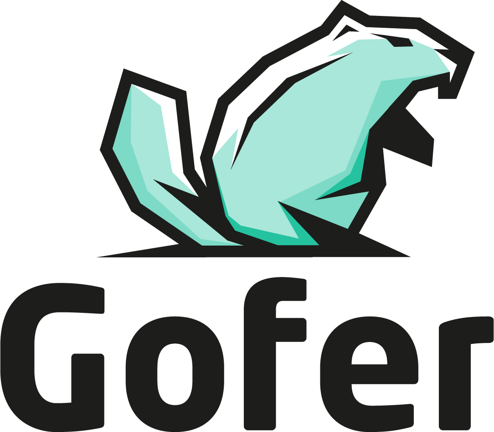
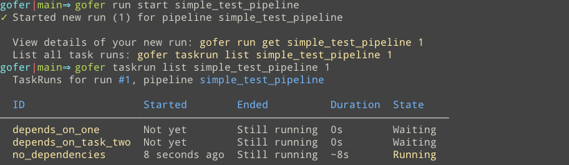

# [Gofer](./urban_dictionary_gofer.png): Run short-lived jobs easily.

    

[![godoc for clintjedwards/gofer][godoc-badge]][godoc-url]
[![goreportcard for clintjedwards/gofer][goreport-badge]][goreport-url]
[![docs site][website-badge]][website-url]
[![project status][project-status]][project-status]

Gofer is a simple, opinionated, cloud-native, container-focused, continuous thing do-er.

- Deploy it as a single static binary
- Pass it declarative configuration
- Watch as it automatically handles scheduling of your short-term automation workloads.

It uses a philosophy similar to [concourse][concourse-url], leveraging the docker container as a key mechanism
to run short-lived workloads. The benefits of this is _simplicity_. No foreign agents, no cluster setup, no yaml mess,
everything is based on the primitive of running a container.

Gofer provides several key features that differ from traditional CI/CD philosophy:

- **Opinionated**: Gofer follows [cloud-native best practices][12factor-url] for configuring and running your short-lived
  jobs. Avoiding the swiss army knife of mess that most CD/CD tools give and instead focuses on delivering an experience where you can be happy with; strong, well-supported core functionality and practices.

- **Pluggable**: Gofer provides pluggable interfaces to run on all your favorite cloud-native tooling. The default service
  is easily run locally making it simple to develop against or troubleshoot. More advanced setups can leverage your
  favorite container orchestrator, object store, and more.

- **DAG(Directed Acyclic Graph) support**: Run simple or complex graphs of containers to accomplish your tasks
  with full DAG support.

  - Run containers in parallel.
  - Wait on the result of other containers.
  - Allow the result of other containers to dictate which downstream containers will run.

- **Decoupled from the repo**: Many modern "ci/cd/ETL/thing do-er" tools focus specifically
  on the concept of git-ops. While this provides some pros for CI specific work, this makes them in-flexible and awkward
  for workloads that require a different paradigm of operation.

  Instead Gofer operates one abstration layer above these tools, offering git-ops as a optional feature and allowing the developer to choose what works best for them. The result is the ability for pipeline owners to impart the same values (stability, predictability, reliability) that brings long-running services success.

  - The ability to properly version.
  - A/B test.
  - [Canarying][canarying-url].

[You can read more about Gofer and it's philosophy here.](https://clintjedwards.com/gofer/docs/intro)

## Documentation & Getting Started

If you want to fully dive into Gofer, check out the [documentation site][website-url]!

## Install

Extended installation information is available through the [documentation site](https://clintjedwards.com/gofer/docs/getting-started/installing-gofer).

### Download a specific release:

You can [view and download releases by version here][releases-url].

### Download the latest release:

- **Linux:** `wget https://github.com/clintjedwards/gofer/releases/latest/download/gofer`

### Build from source:

You'll need to install [protoc and its associated golang/grpc modules first](https://grpc.io/docs/languages/go/quickstart/)

1. `git clone https://github.com/clintjedwards/gofer && cd gofer`
2. `make build OUTPUT=/tmp/gofer`

The Gofer binary comes with a CLI to manage the server as well as act as a client.

## Why not use <insert favorite tool\> instead ?

| Tool                                  | Category                         | Why not?                                                                                                                                                                                                                                                                                                                                                                                                                                                                                                                                                                                                                                                                                                                                                                                                                                                                                                                                                                                                                                                                                                                                                                                                                                   |
| ------------------------------------- | -------------------------------- | ------------------------------------------------------------------------------------------------------------------------------------------------------------------------------------------------------------------------------------------------------------------------------------------------------------------------------------------------------------------------------------------------------------------------------------------------------------------------------------------------------------------------------------------------------------------------------------------------------------------------------------------------------------------------------------------------------------------------------------------------------------------------------------------------------------------------------------------------------------------------------------------------------------------------------------------------------------------------------------------------------------------------------------------------------------------------------------------------------------------------------------------------------------------------------------------------------------------------------------------ |
| Jenkins                               | General thing-doer               | Supports generally anything you might want to do ever, but because of this it can be operationally hard to manage, usually has massive security issues and isn't by default opinionated enough to provide users a good interface into how they should be managing their workloads.                                                                                                                                                                                                                                                                                                                                                                                                                                                                                                                                                                                                                                                                                                                                                                                                                                                                                                                                                         |
| Buildkite/CircleCI/Github actions/etc | Gitops cloud builders            | Gitops focused cloud build tooling is great for most situations and probably what most companies should start out using. The issue is that running your workloads can be hard to test since these tools use custom agents to manage those jobs. This causes local testing to be difficult as the custom agents generally work very differently locally. Many times users will fight with yaml and make commits just to test that their job does what they need due to their being no way to determine that beforehand.                                                                                                                                                                                                                                                                                                                                                                                                                                                                                                                                                                                                                                                                                                                     |
| ArgoCD                                | Kubernetes focused CI/CD tooling | In the right direction with its focus on running containers on already established container orchstrators, but Argo is tied to gitops making it hard to test locally, but also closely tied to Kubernetes.                                                                                                                                                                                                                                                                                                                                                                                                                                                                                                                                                                                                                                                                                                                                                                                                                                                                                                                                                                                                                                 |
| ConcourseCI                           | Container focused thing do-er    | Concourse is great and where much of this inspiration for this project comes from. It sports a sleek CLI, great UI, and cloud-native primatives that makes sense. The drawback of concourse is that it uses a custom way of managing docker containers that can be hard to reason about. This makes testing locally difficult and running in production means that your short-lived containers exist on a platform that the rest of your company is not used to running containers on.                                                                                                                                                                                                                                                                                                                                                                                                                                                                                                                                                                                                                                                                                                                                                     |
| Airflow                               | ETL systems                      | I haven't worked with large scale data systems enough to know deeply about how ETL systems came to be, but (maybe naively) they seem to fit into the same paradigm of "run _x_ thing every time _y_ happens". Airflow was particularly rough to operate in the early days of its release with security and UX around DAG runs/management being nearly non-existent. As an added bonus the scheduler regularly crashed from poorly written user workloads making it a reliability nightmare.    Additionally, Airflow's models of combining the execution logic of your DAGs with your code led to issues of testing and iterating locally.    Instead of having tooling specifically for data workloads, instead it might be easier for both data teams and ops teams to work in the model of distributed cron as Gofer does. Write your stream processing using dedicated tooling/libraries like [Benthos](https://www.benthos.dev/) (or in whatever language you're most familiar with), wrap it in a Docker container, and use Gofer to manage which containers should run when, where, and how often. This gives you easy testing, separation of responsibilities, and no python decorator spam around your logic. |

## Authors

- **Clint Edwards** - [Github](https://github.com/clintjedwards)

This software is provided as-is. It's a hobby project, done in my free time, and I don't get paid for doing it.

[godoc-badge]: https://pkg.go.dev/badge/github.com/clintjedwards/gofer
[godoc-url]: https://pkg.go.dev/github.com/clintjedwards/gofer
[goreport-badge]: https://goreportcard.com/badge/github.com/clintjedwards/gofer
[goreport-url]: https://goreportcard.com/report/clintjedwards/gofer
[website-badge]: https://img.shields.io/badge/docs-learn%20more-3498db?style=flat-square
[website-url]: https://clintjedwards.github.io/gofer
[concourse-url]: https://concourse-ci.org/
[canarying-url]: https://sre.google/workbook/canarying-releases/
[releases-url]: https://github.com/clintjedwards/gofer/releases
[12factor-url]: https://12factor.net/
[project-status]: https://img.shields.io/badge/Project%20Status-Alpha-orange?style=flat-square
