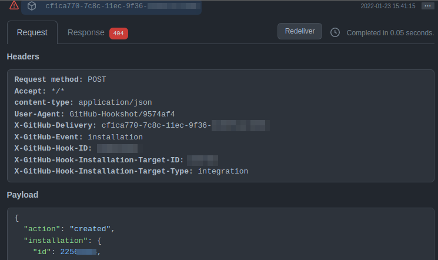

# Github <small>_Extension_</small>

The Github extension allows Gofer pipelines to be run on [Github webhook events.](https://docs.github.com/en/developers/webhooks-and-events/webhooks/webhook-events-and-payloads) This makes it possible to write event driven
workloads that depend on an action happening on Github.

See the [events section below](#events) for all supported events and the environment variables they pass to each
pipeline.

<div class="box note">
  <div class="text">
  <strong>Note:</strong>

  <p>Due to the nature of Github's API and webhooks, you'll need to first set up a new Github app to use with Gofer's Github extension.</p>
  <i>

  Steps to accomplish this can be found in the [additional steps section.](#additional-setup)

  </i>
  </div>
</div>

<div class="box danger">
  <div class="text">
  <strong>Danger:</strong>

  <p>

  The Github extension requires the [external events feature](../../server_configuration/external_events.md) of Gofer in order to accept webhooks from Github's servers. This requires your application to take traffic from external, potentially unknown sources.

  Visit the [external events page](../../server_configuration/external_events.md) for more information on how to configure Gofer's external
  events endpoint.

  If Github is your only external extension, to increase security consider [limiting the IP addresses](https://docs.github.com/en/authentication/keeping-your-account-and-data-secure/about-githubs-ip-addresses) that can access Gofer's external events endpoint.
  </p>
  </div>
</div>

## Pipeline Configuration

| Key                | Default  | Description                                                                                                                                                             |
| -------------------| -------- | ----------------------------------------------------------------------------------------------------------------------------------------------------------------------- |
| repository         | Required | The Github repository you would like to listen for events from. The format is in the form.                                                                              |
| event_filter       | Required | The event/action combination the pipeline will be triggered upon. It is presented in the form: `<event>/<action1>,<action2>...`. For events that do not have actions or if you simply want to trigger on any action, just putting the \<event\> will suffice. |

<div class="box note">
  <div class="text">
  <strong>Note:</strong>

  <p>If you don't include actions on an event that has multiple, Gofer will be triggered on any action. You can
  find a list of events and their actions here(Actions listed as 'activity type' in Github nomenclature.):
  https://docs.github.com/en/actions/using-workflows/events-that-trigger-workflows</p>

  </div>
</div>

### Example

```bash
gofer pipeline subscribe simple github run_tests \
    -s "repository=clintjedwards/experimental" \
    -s "event_filter=pull_request_with_check/opened,synchronize,reopened"
```
## Extension Configuration

Extension configurations are set upon startup and cannot be changed afterwards.

The Github extension requires the setup and use of a [new Github app](https://docs.github.com/en/developers/apps/getting-started-with-apps/about-apps). You can [view setup instructions below](#additional-setup) which will walk you through how to retrieve the required env var variables.

| Key                | Default  | Description                                                                                                                                                             |
| -------------------| -------- | ----------------------------------------------------------------------------------------------------------------------------------------------------------------------- |
| APP_ID             | Required | The Github app ID                                                                                                                                                       |
| APP_INSTALLATION   | Required | The Github installation ID. This can be found by viewing the webhook payload delivery. See a more details walkthrough on where to find this below.                      |
| APP_KEY            | Required | The base64'd private key of the Github app. This can be generated during Github app creation time.                                                                      |
| APP_WEBHOOK_SECRET | Required | The Github app webhook secret key. This should be a long, randomized character string. It will be used to verify that an event came from Github and not another source. |

### Example

```bash
gofer extension install github ghcr.io/clintjedwards/gofer/extension_github:latest \
    -c "APP_ID=112348" \
    -c "APP_INSTALLATION=99560091" \
    -c "APP_KEY=TUtkUnhYY01LTUI1ejgzZU84MFhKQWhoNnBka..." \
    -c "APP_WEBHOOK_SECRET=somereallylongstringofcharacters"
```

### Additional setup

Due to the nature of Github's API and webhooks, you'll need to first set up a new Github app to use with Gofer's Github extension.
Once this app has been set up, you'll have access to all the required environment variables that you'll need to pass into Gofer's server configuration.

Here is a quick and dirty walkthrough on the important parts of setting up the Github application.

#### 1. Create a new Github application:

[Github's documentation](https://docs.github.com/en/developers/apps/building-github-apps/creating-a-github-app) will be the most up to date and relevant so please see their walkthrough.

On the configuration page for the new Github application the following should be noted:

- **APP ID**: Take note of the id; it will be used later for extension configuration.
- **Webhook URL**: Should be the address of your Gofer's external extension instance and pointing to the events/github endpoint:

  `ex: https://mygoferinstance.yourdomain.com/external/github`

- **Webhook Secret**: Make this a secure, long, random string of characters and note it for future extension configuration.
- **Private Keys**: Generate a private key and store it somewhere safe. You'll need to base64 this key and insert it into the extension configuration.

  `base64 ~/Desktop/myorg-gofer.2022-01-24.private-key.pem`

<div class="box note">
  <div class="text">
  <strong>Note:</strong>

  <p>

  If you need a logo for your new Github application you're welcome to use [logo-small](../../../assets/logo-small.png)
  </p>
  </div>
</div>

#### 2. Find the installation ID

Once the Github application has been created, [install it.](https://docs.github.com/en/developers/apps/managing-github-apps/installing-github-apps)
This will give you an opportunity to configure the permissions and scope of the Github application.
It is recommended that you give read-only permissions to any permissions that might include webhooks and read-write for `code-suite` and `code-runs`.

You might also utilize this Github App to perform other actions within Github with either other extensions or your own pipeline jobs. Remember to allow the correct permissions for all use cases.

The installation ID is unfortunately hidden in an event that gets sent once the Github app has been created and installed. You can find it by navigating to the settings page for the Github application and
then viewing it in the "Recent Deliveries" page.

> 🪧 These recent deliveries only last a short amount of time, so if you take a while to check on them, they might not exist anymore. If that has happened you should be able to create another event and that will create another recent delivery.




## Events

Gofer's extensions have the ability to pass along event specific information in the form of environment variables that
get injected into each container's run. Most of these variables are pulled from the webhook request that comes in.

Below is a breakdown of the environment variables that are passed to a run based on the event that was generated.
You can find more information about the format the variables will be in by [referencing the payloads for the event](https://docs.github.com/en/developers/webhooks-and-events/webhooks/webhook-events-and-payloads).

Events below are the only events that are supported.

| Event                    | Metadata                                                                                                                                                                                                                                                                                                                                                                                                                                                       |
| ------------------------ | -------------------------------------------------------------------------------------------------------------------------------------------------------------------------------------------------------------------------------------------------------------------------------------------------------------------------------------------------------------------------------------------------------------------------------------------------------------- |
| pull_request             | "GOFER_EXTENSION_GITHUB_EVENT" <br/>"GOFER_EXTENSION_GITHUB_ACTION"<br/>"GOFER_EXTENSION_GITHUB_PULLREQUEST_HEAD_REF"<br/>"GOFER_EXTENSION_GITHUB_REPOSITORY"<br/>"GOFER_EXTENSION_GITHUB_PULLREQUEST_HEAD_SHA"<br/>"GOFER_EXTENSION_GITHUB_PULLREQUEST_AUTHOR_USERNAME"<br/>"GOFER_EXTENSION_GITHUB_PULLREQUEST_AUTHOR_EMAIL"<br/>"GOFER_EXTENSION_GITHUB_PULLREQUEST_AUTHOR_NAME"<br/>                                                                       |
| pull_request_with_check  | "GOFER_EXTENSION_GITHUB_EVENT" <br/>"GOFER_EXTENSION_GITHUB_ACTION"<br/>"GOFER_EXTENSION_GITHUB_PULLREQUEST_HEAD_REF"<br/>"GOFER_EXTENSION_GITHUB_REPOSITORY"<br/>"GOFER_EXTENSION_GITHUB_PULLREQUEST_HEAD_SHA"<br/>"GOFER_EXTENSION_GITHUB_PULLREQUEST_AUTHOR_USERNAME"<br/>"GOFER_EXTENSION_GITHUB_PULLREQUEST_AUTHOR_EMAIL"<br/>"GOFER_EXTENSION_GITHUB_PULLREQUEST_AUTHOR_NAME"<br/>                                                                       |                                                                                                                                                                                                                                                                        |
| push                     | "GOFER_EXTENSION_GITHUB_EVENT":<br/>"GOFER_EXTENSION_GITHUB_ACTION"<br/>"GOFER_EXTENSION_GITHUB_REF"<br/>"GOFER_EXTENSION_GITHUB_REPOSITORY"<br/>"GOFER_EXTENSION_GITHUB_HEAD_COMMIT_ID"<br/>"GOFER_EXTENSION_GITHUB_HEAD_COMMIT_AUTHOR_NAME"<br/>"GOFER_EXTENSION_GITHUB_HEAD_COMMIT_AUTHOR_EMAIL"<br/>"GOFER_EXTENSION_GITHUB_HEAD_COMMIT_AUTHOR_USERNAME"<br />"GOFER_EXTENSION_GITHUB_HEAD_COMMIT_COMMITTER_NAME"<br />"GOFER_EXTENSION_GITHUB_HEAD_COMMIT_COMMITTER_EMAIL"<br />"GOFER_EXTENSION_GITHUB_HEAD_COMMIT_COMMITTER_USERNAME"<br />|
| release                  | "GOFER_EXTENSION_GITHUB_ACTION"<br/>"GOFER_EXTENSION_GITHUB_REPOSITORY"<br/>"GOFER_EXTENSION_GITHUB_RELEASE_TAG_NAME"<br/>"GOFER_EXTENSION_GITHUB_RELEASE_TARGET_COMMITISH"<br/>"GOFER_EXTENSION_GITHUB_RELEASE_AUTHOR_LOGIN"<br/>"GOFER_EXTENSION_GITHUB_RELEASE_CREATED_AT"<br/>"GOFER_EXTENSION_GITHUB_RELEASE_PUBLISHED_AT"                                                                                                                                |

<div class="box note">
  <div class="text">
  <strong>Note:</strong>

  <p>The event <code>pull_request_with_check</code> is a special event not found within the Github API. It's primarily
  to be used when the subscriber wants to report the job status back to the pull request based on the result of the job started</p>
  </div>
</div>


<style>
.box {
    padding: 10px 15px;
    margin: 10px 0;
    align-items: center;
}

.note {
    border-left: 5px solid #0074d9;
}

.danger {
    border-left: 5px solid #FF6961;
}
</style>
